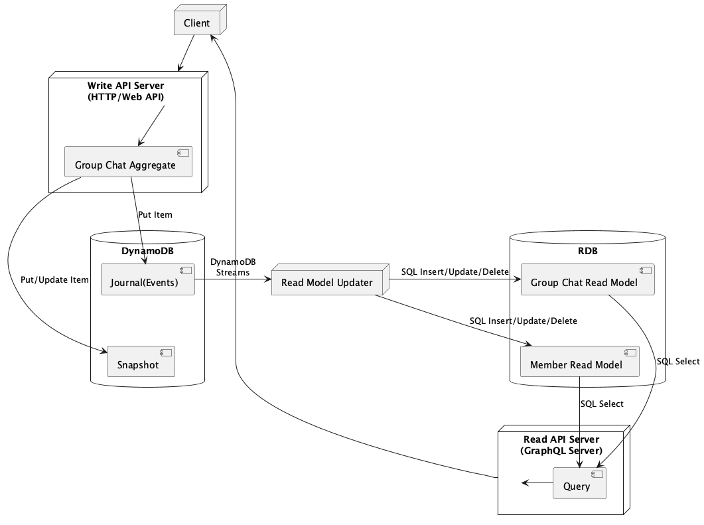

## 設計
## システムアーキテクチャ
CQRS (Command Query Responsibility Segregation) / ES (Event Sourcing) の原則([CQRS提唱者のドキュメント](https://cqrs.wordpress.com/wp-content/uploads/2010/11/cqrs_documents.pdf))に基づいて設計されており、Domain-Driven Design (DDD) の実装を容易にすることを目的としています。

### 主な特徴

1. 読み取り操作（Query）と書き込み操作（Command）の分離:
   - システムの読み取りと書き込みの関心事を明確に分離
   - これにより、各操作に最適化されたモデルやデータストアを使用できる

2. イベントソーシング:
   - すべての状態変更をイベントとしてDynamoDBに保存
   - システムの完全な監査証跡が維持され、任意の時点の状態を再現できる

3. DDDとの親和性:
   - 集約ルートを中心とした設計が容易になり、ドメインの境界がより明確になる
   - ユビキタス言語の使用を促進し、ドメインエキスパートと開発者のコミュニケーションを改善する

### 利点

- スケーラビリティ: 読み取りと書き込みを独立してスケールアウトできる
- パフォーマンス: 各操作に最適化されたデータモデルを使用できるため、全体的なパフォーマンスが向上
- データの整合性: イベントソーシングにより、データの変更履歴が完全に保持される
- システム状態の再現: 任意の時点のシステム状態を容易に再現できる
- ドメインモデルの純粋性: DDDの原則に従いやすく、ビジネスロジックをより明確に表現できる

この設計アプローチにより、複雑なドメインロジックを持つシステムでも、より保守性が高く、拡張性のある実装が可能になります。



### コンポーネント構成

- Write API Server
  - 書き込み操作を受け付けるサーバー
  - 今回のシステムではDynamoDBへイベントの書き込みを行う
  - APIはGraphQL(Mutation)で実装
- Read Model Updater
  - ジャーナルに基づいてリードモデルを構築するアプリケーション
  - 今回のシステムではDynamoDB Streamsからイベントの情報を受け取ってRead用のRDBに書き込む
  - サーバーレスで動かすことを想定した実装(今回のインターンシップではローカル実行のみ)
- Read API Server
  - 読み取り操作を受け付けるサーバー
  - 今回のシステムではRDBからデータを取得する
  - APIはGraphQL(Query)で実装


## ソフトウェアアーキテクチャ
クリーンアーキテクチャと呼ばれるパターンに近しい形で設計されています。
(完全に則っているわけではありません)


**出典：https://blog.cleancoder.com/uncle-bob/2012/08/13/the-clean-architecture.html**

### 概要

ソフトウェアを下記のレイヤーに分類し、各レイヤーの依存を一方向 (下記だと下から上への方向) になるように実装しています。  
(()内は下記の[ディレクトリ構成](#ディレクトリ構成)との対応)

- Enterprise Business Rule (domain)
- Application Business Rule (processor)
- Interface Adapters (interface-adapter-impl)
- Frameworks & Drivers (bootstrap)

### 利点

- 独立性：ビジネスロジックがフレームワーク、UI、データベースなどの外部要素に依存しないため、技術的な選択や変更に柔軟に対応可能
- テスト容易性：ドメインロジックが外部依存関係から分離されているため、単体テストが容易になり、品質の高いソフトウェアを維持しやすくなる
- 保守性と拡張性：モジュールが明確に分離されているため、新機能の追加や既存機能の変更が容易で、コードの保守性が向上する


## ディレクトリ構成
`backend/`配下は次のような構成になっています。

```
.
├── bootstrap
├── command
│   ├── domain
│   ├── interface-adaptor-if
│   ├── interface-adaptor-impl
│   └── processor
├── infrastructure
├── query
│   └── interface-adaptor
└── rmu
```

### `bootstrap`
- アプリケーションの起動や初期設定に関するファイルを含むディレクトリ
- 環境変数からの設定の読み込み、依存関係の注入など起動に必要な準備作業を行う
### `command`
- CQRSにおける`Command`を担当するディレクトリ
- 主にデータの変更(書き込み)に関連する処理を行う
- `domain`
  - エンティティや値オブジェクトなどのドメインロジックを持ったファイルを含むディレクトリ
  - 他のどのディレクトリにも依存しない
- `interface-adaptor-if`/`interface-adaptor-impl`
  - 外部のシステム(DynamoDBやクライアント)と連携するためのファイルを含むディレクトリ
- `interface-adaptor-if`でインターフェースのみを定義
- `interface-adaptor-impl`はその実装となっている
- `processor`
  - コマンドの処理を担当するファイルを含むディレクトリ
  - コマンドを受け取り、適切なドメインロジックを実行する
### `infrastructure`
- ULID のヘルパなど各層から依存されるヘルパコンポーネントが設置されるディレクトリ
### `query`
- CQRSにおける`Query`を担当するディレクトリ
- 主にデータの読み取りに関連する処理を行う
- `interface-adaptor`
  - 外部のシステム(RDBやクライアント)と連携するためのファイルを含むディレクトリ
### `rmu`
- CQRSのうちWriteモデルからReadモデルを更新するためのロジックを持ったファイルを含むディレクトリ
- イベントソーシングを利用して、イベントが発生した際にReadを最新の状態に保つ
