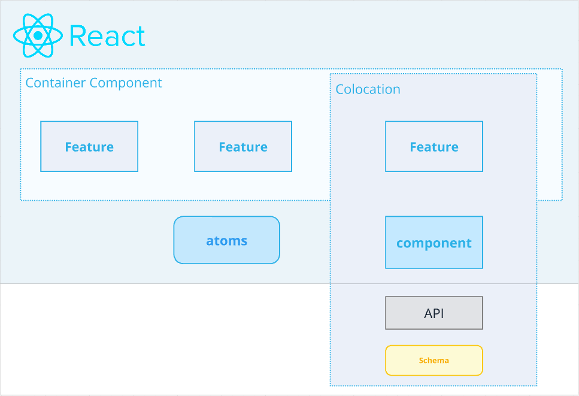

# frontend/src
## 設計
機能を関心事としたディレクトリ設計にしています。


### FeatureによるColocation
機能ごとにディレクトリを分け、その中にコンポーネントやAPIリクエストを配置しています。
原則、機能間の依存はないように実装します。
Feature間で共通で使用したいものがある場合は、別途切り出します。

#### Fragment Colocation
Fragment Colocationは、GraphQLフラグメントをReactコンポーネントと一緒に配置する方法です。
コンポーネントが必要とするデータをフラグメントにまとめて同じ場所に配置することで
- Query, Mutationを実行するコンポーネントと結果を必要とするコンポーネントとの関心の分離が可能
- 依存関係の明確化
- Fragmentを元に生成した型を利用するので、保守性が高くなる

https://www.apollographql.com/docs/react/data/fragments/#colocating-fragments

## ディレクトリ構成
`src` 配下は次のような構成になっています。

```
.
├── __generated__
│   ├── command
│   └── query
├── application
├── features
│   └── CreateGroupChatDialog
├── local-service
│   └── auth
├── mocks
├── styles
└── ui
    ├── CheckBox
    ├── Dialog
    ├── IconButton
    ├── TextButton
    └── TextField
```

### `__generated__`

- バックエンドに基づいて自動生成されたコードが入るディレクトリ
- 書き込み側である `command` と読み込み側である `query` のサブディレクトリで構成

### `application`

- アプリケーション全体をつかさどる処理が入るディレクトリ
- エントリーポイントである `RootApplication.tsx` などで構成

### `features`

- アプリケーションの各機能が入るディレクトリ
- `機能名Container.tsx`
  - いわゆるコンテナーコンポーネント
  - 配下のコンポーネントに関するデータの収集・送信やユーザーアクションのハンドリングなど、実質的な処理を担当する
- `api`
  - 機能単位で利用するapiリクエストを定義する
- `components`
  - いわゆるプレゼンテーションコンポーネント
  - 受け取ったデータに応じて、どう表示するかを担当する

### `local-service`

- フロントエンドに閉じたロジック処理が入るディレクトリ
- ユーザー認証はフロントエンドで擬似的に再現している都合上、 `auth` サービスを持つ
  - auth サービス内には React のプロバイダーやフック、その他ツール的に使えるコードなどを持つ

### `mocks`

- StorybookやTestなどで使用するmockを定義している
- ローカルで動かす際のユーザーのmockデータも保持している

### `styles`

- 全体として共通のスタイルを定義、管理している
- ex. color, spacer, typography...

### `ui`

- 使い回すことができる UI 部品が入るディレクトリ
- `部品名.tsx`
  - コンポーネント本体
- `style.ts`
  - コンポーネントに対してスタイル(CSS)を提供する
- `*.stories.tsx`
  - UI カタログである Storybook に登録するためのファイル
